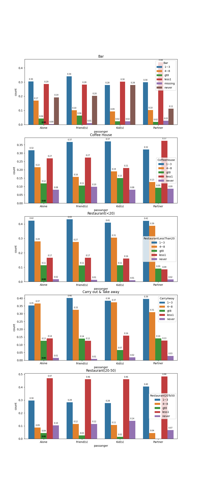
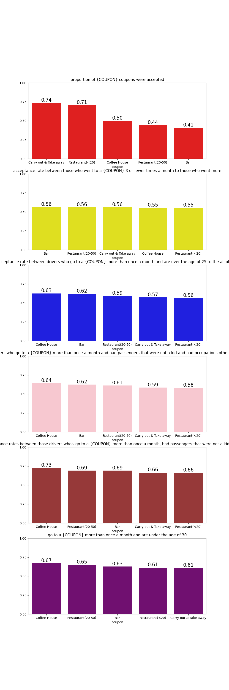

# Will a customer accept the coupon?
The goal of this project is to use what you know about visualizations and probability distributions to distinguish between customers who accepted a driving coupon versus those that did not.

<h1>Observations</h1>
<ol>
    <li>Bar coupons not seem to be very popular among this population as only 41% of the population accepted the Bar coupon</li>
    <li>Drivers that go to a bar more than once a month, have passengers that are not a kid and are not widowed seem to be the best candidates for accepting the Bar coupons.
</li>
    <li>Age does not seem to be a deterministic factor as we can see people under the age of 30 that have a very similar acceptance rate to those over the age of 25.  However, 60% of age 41 that go less than 1 times per month accepted the Bar coupon </li>
    <li>Drivers with a Kid(s) as a passenger are less responsive to the Bar coupons</li>
    <li>Those drivers that go to a bar more than once a month are more likely to accept the Bar coupon</li>
</ol>    

<h1>Recommendations</h1>
<ol>
    <li>
        There is no information about what the discount is, perhaps increasing the discount would attract more drivers to accept the coupon
    </li>
</ol>

<h1>Comparison Table</h1>
<table style="background-color:white;">
    <thead style="backgroud-color:yellow">
    <tr>
        <td>coupon</td>
        <td>proportion of {COUPON} coupons were accepted</td>
        <td>acceptance rate between those who went to a {COUPON} 3 or fewer times a month to those who went more</td>
        <td>acceptance rate between drivers who go to a {COUPON} more than once a month and are over the age of 25 to the all others</td>
        <td>acceptance rate between drivers who go to a {COUPON} more than once a month and had passengers that were not a kid and had occupations other than farming, fishing, or forestry</td>
        <td>Compare the acceptance rates between those drivers who:- go to a {COUPON} more than once a month, had passengers that were not a kid, and were not widowed</td>
        <td>go to a {COUPON} more than once a month and are under the age of 30</td>
        <td>go to cheap restaurants more than 4 times a month and income is less than 50K</td>
    </tr>
    <tr>
       <td></td>
       <td><table><tbody><tr><td>0</td><td>1</td></tr></tbody></table></td>
       <td><table><tbody><tr><td>0</td><td>1</td></tr></tbody></table></td>
       <td><table><tbody><tr><td>0</td><td>1</td></tr></tbody></table></td>
       <td><table><tbody><tr><td>0</td><td>1</td></tr></tbody></table></td>
       <td><table><tbody><tr><td>0</td><td>1</td></tr></tbody></table></td>
       <td><table><tbody><tr><td>0</td><td>1</td></tr></tbody></table></td>
       <td><table><tbody><tr><td>0</td><td>1</td></tr></tbody></table></td>
    </tr>
    </thead>
    <tbody style="backgroud-color:yellow;color:blue;">
    <tr>
        <td>Bar</td>
        <td><table><tbody><tr><td>0.589985</td><td>0.410015</td></tr></tbody></table></td>
        <td><table><tbody><tr><td>0.437948</td><td>0.562052</td></tr></tbody></table></td>
        <td><table><tbody><tr><td>0.378466</td><td>0.621534</td></tr></tbody></table></td>
        <td><table><tbody><tr><td>0.376894</td><td>0.623106</td></tr></tbody></table></td>
        <td><table><tbody><tr><td>0.30976</td><td>0.69024</td></tr></tbody></table></td>
        <td><table><tbody><tr><td>0.371919</td><td>0.628081</td></tr></tbody></table></td>
        <td><table><tbody><tr><td>0.406044</td><td>0.593956</td></tr></tbody></table></td>        
    </tr>
    </tbody>
</table>

<h4>Note: 0 Not Accepted, 1 Accepted</h4>    

<h1>Independent Investigation</h1>

The following observations are a result of the analysis carried out in the table and plots below, as they give a very comprenhensive view of the coupon acceptance among drivers.

    
<h2>Observations</h2>
<ol>
    <li>
Drivers that have their Partner as a passenger and go less than 1 times a month to a Bar are the ones more likely to accept the Bar coupon
    </li>
    <li>
There is very little difference on who goes as a passenger for those who accepted the Restaurant less than 20 coupon. However, people that go 1 to 3 times a month to a restaurant less than 20 are more likely to accept this coupon.        
    </li>
    <li>
Drivers that go with their partner or with a Friend(s) and go between 1 and 3 times a month are more likely to accept the Carry Away coupon.
    </li>
    <li>
Drivers that go less than 1 times a month to a Restaurant between 20 and 50 are more likely to accept the Restaurant (20-50) coupon.
    </li>
<li>
The portion of Carry out and Take away coupons were the most accepted with 74% followed by Restaurants with less than 20 with 71%
</li>
<li>
There is no difference between those who go 3 times or less to those who go more.    
</li>
<li>
Coffee House coupon is the most popular amongst:
<ul>
    <li>
Drivers that have a Kid(s) or a Friend(s) as a passenger and go to a Coffee House 1 or 3 times a month are the more likely to accept the Coffee House coupon
    </li>
<li>
Drivers that go once a month and are over the age of 25
    </li>
    <li>
Drivers that go more than once a month, have a passenger that is not a kid and their occupation is not farming, fishing or forestry        
    </li>
    <li>
Drivers that go more than once a month, their passenger is not a kid and are not widowed
    </li>
    <li>
Drivers that go more than once a month and are under the age of 30
    </li>
</ul>    
</li>
</ol>
    

    <h1>Recommendatios</h1>
    <ol>
        <li>
            Considering that the Bar coupon the least popular.  Changing the expiry date of the Bar coupon could attract more customers.  Also, there is no evidence of this in the information provided but perhaps drink driving might be a restriction for accepting the coupon.
        </li>
        <li>Rather than inviting the customer to go to the business premises, perhaps, home delivery would be a more attractive option for the drivers.  
            This could be an alternative for those that did not accept the coupon.
        </li>
        <li>As mentioned before, there is no information about what the discount is, but variations of the discount depending on the business might attract more customers.  </li>
        <li>Drivers that go more than 8 times a month to any business are less likely to accept the coupon. 
        So, a different type of discount maybe necessary like a loyalty card that gives them other discounts.</li>
    </ol>

    <h1>Comparison Table</h1>

In this table we can see all the values for the different criteria

  
<table style="background-color:white;">
    <thead style="backgroud-color:yellow">
    <tr>
        <td>coupon</td>
        <td>proportion of {COUPON} coupons were accepted</td>
        <td>acceptance rate between those who went to a {COUPON} 3 or fewer times a month to those who went more</td>
        <td>acceptance rate between drivers who go to a {COUPON} more than once a month and are over the age of 25 to the all others</td>
        <td>acceptance rate between drivers who go to a {COUPON} more than once a month and had passengers that were not a kid and had occupations other than farming, fishing, or forestry</td>
        <td>Compare the acceptance rates between those drivers who:- go to a {COUPON} more than once a month, had passengers that were not a kid, and were not widowed</td>
        <td>go to a {COUPON} more than once a month and are under the age of 30</td>
        <td>go to cheap restaurants more than 4 times a month and income is less than 50K</td>
    </tr>
    <tr>
        <td></td>
       <td><table><tbody><tr><td>0</td><td>1</td></tr></tbody></table></td>
       <td><table><tbody><tr><td>0</td><td>1</td></tr></tbody></table></td>
       <td><table><tbody><tr><td>0</td><td>1</td></tr></tbody></table></td>
       <td><table><tbody><tr><td>0</td><td>1</td></tr></tbody></table></td>
       <td><table><tbody><tr><td>0</td><td>1</td></tr></tbody></table></td>
       <td><table><tbody><tr><td>0</td><td>1</td></tr></tbody></table></td>
       <td><table><tbody><tr><td>0</td><td>1</td></tr></tbody></table></td>
    </tr>
    </thead>
    <tbody>
    <tr>
        <td>Bar</td>
        <td><table><tbody><tr><td>0.589985</td><td>0.410015</td></tr></tbody></table></td>
        <td><table><tbody><tr><td>0.437948</td><td>0.562052</td></tr></tbody></table></td>
        <td><table><tbody><tr><td>0.378466</td><td>0.621534</td></tr></tbody></table></td>
        <td><table><tbody><tr><td>0.376894</td><td>0.623106</td></tr></tbody></table></td>
        <td><table><tbody><tr><td>0.30976</td><td>0.69024</td></tr></tbody></table></td>
        <td><table><tbody><tr><td>0.371919</td><td>0.628081</td></tr></tbody></table></td>
        <td><table><tbody><tr><td>0.406044</td><td>0.593956</td></tr></tbody></table></td>        
    </tr>
    <tr>
        <td>
            Coffee House
        </td>
        <td><table><tbody><tr><td>0.500751</td><td>0.499249</td></tr></tbody></table></td>
        <td><table><tbody><tr><td>0.445091</td><td>0.554909</td></tr></tbody></table></td>
        <td><table><tbody><tr><td>0.374453</td><td>0.625547</td></tr></tbody></table></td>
        <td><table><tbody><tr><td>0.357985</td><td>0.642015</td></tr></tbody></table></td>
        <td><table><tbody><tr><td>0.27299</td><td>0.72701</td></tr></tbody></table></td>
        <td><table><tbody><tr><td>0.329211</td><td>0.670789</td></tr></tbody></table></td>
        <td><table><tbody><tr><td>0.406044</td><td>0.593956</td></tr></tbody></table></td>        
    </tr>
    <tr>
        <td>Restaurant(<20)</td>
        <td><table><tbody><tr><td>0.292893</td><td>0.707107</td></tr></tbody></table></td>
        <td><table><tbody><tr><td>0.445453</td><td>0.554547</td></tr></tbody></table></td>
        <td><table><tbody><tr><td>0.436398</td><td>0.563602</td></tr></tbody></table></td>
        <td><table><tbody><tr><td>0.419152</td><td>0.580848</td></tr></tbody></table></td>
        <td><table><tbody><tr><td>0.336397</td><td>0.663603</td></tr></tbody></table></td>
        <td><table><tbody><tr><td>0.386693</td><td>0.613307</td></tr></tbody></table></td>
        <td><table><tbody><tr><td>0.406044</td><td>0.593956</td></tr></tbody></table></td>        
    </tr>
    <tr>
        <td>Carry out & Take away</td>
        <td><table><tbody><tr><td>0.264522</td><td>0.735478</td></tr></tbody></table></td>
        <td><table><tbody><tr><td>0.440574</td><td>0.559426</td></tr></tbody></table></td>
        <td><table><tbody><tr><td>0.428049</td><td>0.571951</td></tr></tbody></table></td>
        <td><table><tbody><tr><td>0.414897</td><td>0.585103</td></tr></tbody></table></td>
        <td><table><tbody><tr><td>0.335053</td><td>0.664947</td></tr></tbody></table></td>
        <td><table><tbody><tr><td>0.392216</td><td>0.607784</td></tr></tbody></table></td>
        <td><table><tbody><tr><td>0.406044</td><td>0.593956</td></tr></tbody></table></td>        
    </tr>
    <tr>
        <td>Restaurant(20-50)</td>        
        <td><table><tbody><tr><td>0.558981	</td><td>0.441019</td></tr></tbody></table></td>
        <td><table><tbody><tr><td>0.439104	</td><td>0.560896</td></tr></tbody></table></td>
        <td><table><tbody><tr><td>0.405635	</td><td>0.594365</td></tr></tbody></table></td>
        <td><table><tbody><tr><td>0.386711	</td><td>0.613289</td></tr></tbody></table></td>
        <td><table><tbody><tr><td>0.309091	</td><td>0.690909</td></tr></tbody></table></td>
        <td><table><tbody><tr><td>0.34964	</td><td>0.65036</td></tr></tbody></table></td>
        <td><table><tbody><tr><td>0.406044</td><td>0.593956</td></tr></tbody></table></td>        
    </tr>
        </tbody>
</table>    

    <h1>Plots</h1>
    
We can see in the following plots the distribution of all coupons in relation to the type of passengers and the frequency of their visits

    

    <h2>Same analysis performed in section 1 for Bar coupon but this time for all coupons</h2>
        

